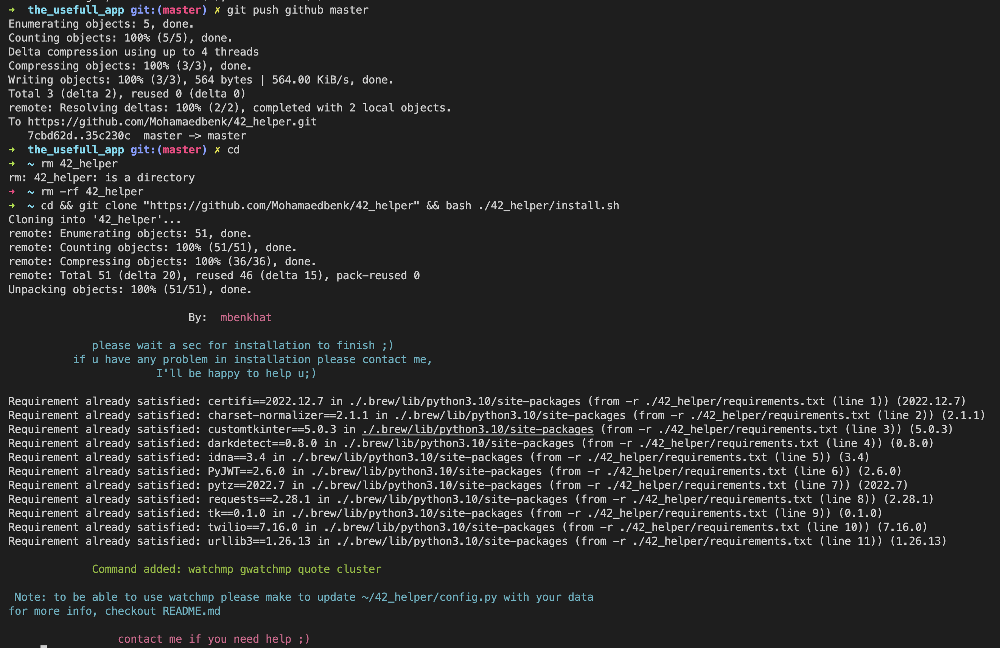
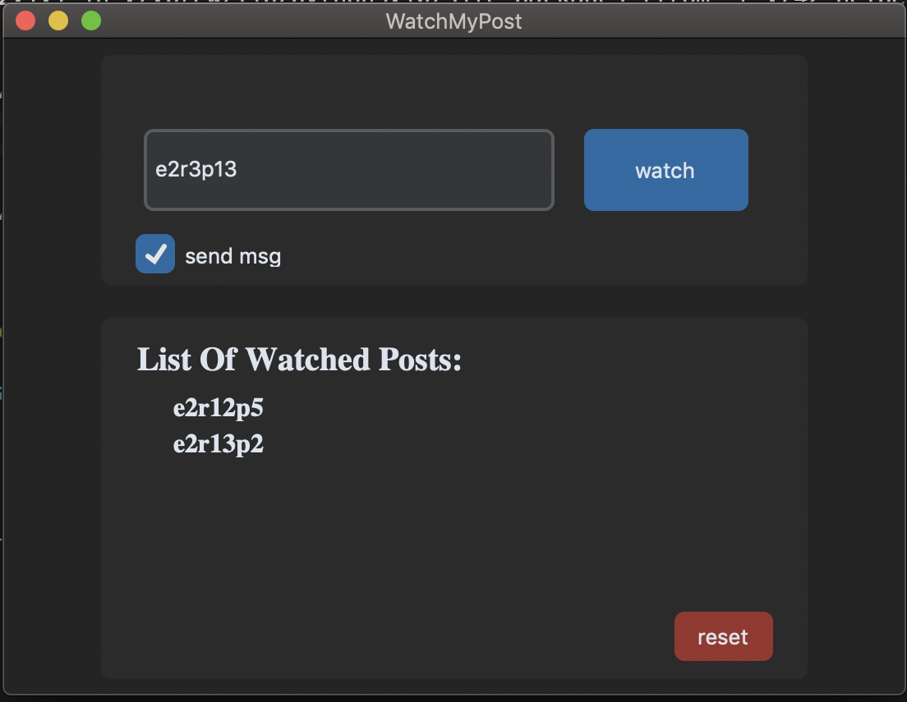

# hello

## What is 42_helper?
    A set of tools and Shortcuts to help 42Network/1337 Students.

## How to install?
> cd && git clone "https://github.com/Mohamaedbenk/42_helper" && bash ./42_helper/install.sh
1. First: Run the command above in your `shell`.
1. Second: `Don't follow this step if you don't want watchmp` 
(this step may be kind of tedious, so please don't hesitate to contact me) 
step 1: Go to https://meta.intra.42.fr/clusters.json  
step 2: Open Network (Right click -> inspect -> go to Network tap) 
step 3: Refresh the page and go to clusters.json 
step 4: Copy as cURL (Right click clusters.json -> hover over copy -> click `Copy as cURL`)  
step 5: Go to https://curlconverter.com/ and past data -> chose python -> copy (cookies, headers) -> past in config.py 
3. Third: `Only follow this step if you have Twilio account and you want msg support for gwatchmp` 
4. fourth: Enjoy ;)

## How to use?
Run `cclean` just like old cclean but better (3x times faster than old cclean)  
Run `quote` to get a random quote when you need it  
Run `cluster` to open a cluster in new tap 
Run `watchmp (post1) (post2) (post3 ...)` to get notified when post is empty 
Run `gwatchmp (post1) (post2) (post3 ...)` same as `watchmp` but uses GUI and supports message notification 

## Screenshots
<h3>Installation Overview:</h3>

<h3>`gwatchmp` Overview:</h3>

## Note : 

    As with everything in life, this product isn't perfect 
    Every software in this app has solved one of my problems, it will not necessarily solve one of yours, so please use what you need and leave what you don't. 
    This app is still in development, I'll always be adding new features. this is not everything.

## Last :
This app was time-consuming, I had to learn Python/shell scripting and go through tens of Stackoverflow pages to get what's in front of you, hope it was worth it...
Thanks ;) 
